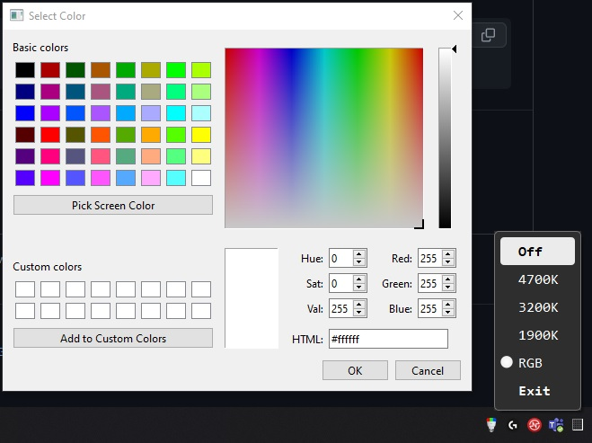



## Installation

```bash
pip install PySide6
pip install yeelight
```

Set your bulb's local ipv4 address

```bash
bulb = Bulb("192.168.0.1")
```

### Run on startup

change project folder path to yours and add yeelight.cmd file with this command to folder Win + R -> shell:startup

```bash
pythonw C:\code\python\yeeelight\main.pyw
```
